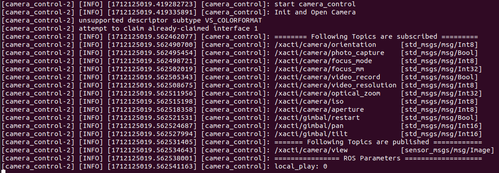
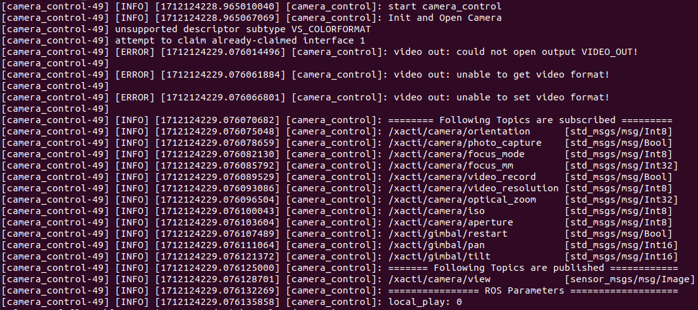

# XACTI CX-GB400 Gimbal Camera with ROS2

Basically, the XACTI gimbal camera is communicating via UVC protocol by just one single USB connection to computer then the video and gimbal could be controlled. For an expert developer with more experiences of UVC, you could check on the [XACTI UVC command list](./docs/CX-GBシリーズ_UVCコマンドリスト_ver1.1.1.pdf) then develop by your own.

The purpose of this project is to let the ROS developer easily connects their XACTI CX-GB400 camera with their robot system, and have a control via ROS topic.

## Hardware

Only CX-GB400 gimbal camera is not enough, you will need to have AX-DM100 which is the base mounting adapter to provide USB connection to the CX-GB400. So please make sure to have both.

Here are the things you will need to prepare,

- CX-GB400 gimbal camera from XACTI
- AX-DM100 base mounting plate from XACTI
- JST connector ZER-08V-S 
- JST contactor SZE-002T-P0.3 
- micro SD card 
- USB-A to USB-C cable (make sure it has data line, not only for charging)
- some wires for power cable
- linux computer

The hardware diagram is shown as below and you can follow the following steps


1. First you will need to plug the CX-GB400 to AX-DM100 by sliding in and lock. 
2. Then insert a micro SD card into CX-GB400.
3. Make a power cable with JST connector and contactor, please check the pin assign from [this document](./docs/AX-DM100_インターフェース仕様_ver2.1.pdf). 
4. Connect power cable to AX-DM100's JST port, and connect USB between computer and AX-DM100
5. Mounting position is important, as in the picture is **Upper Mount**, so you will need to choose either of Lower or Upper mount

## Install

- install libuvc by following steps
```sh

	## Install some dependencies
	sudo apt-get install -y libusb-1.0-0-dev libturbojpeg-dev

	## Install libuvc
	cd /home/$USER
	git clone https://github.com/libuvc/libuvc.git
	cd /home/$USER/libuvc
	mkdir build
	cd build
	cmake ..
	make
	sudo make install
	sudo ldconfig

	## Setup udev rules
	echo 'SUBSYSTEM=="usb",  ENV{DEVTYPE}=="usb_device", GROUP="plugdev", MODE="0664"' | sudo tee /etc/udev/rules.d/10-libuvc.rules > /dev/null
	sudo udevadm trigger
	sudo usermod -a -G plugdev $USER
	### better to re-plug all USB devices

```

- [ROS2 Galactic](https://docs.ros.org/en/galactic/Installation.html) 
- `sudo apt install python3-colcon-common-extensions`
- `sudo apt install ros-galactic-image-transport`
- install v4l2loopback by following steps

```sh
	## 1. Install v4l2loopback, choose either one of the following method
	### method 1
	sudo apt-get install -y v4l2loopback-utils
	### method 2
	cd /home/$USER/
	git clone https://github.com/umlaeute/v4l2loopback.git
	cd /home/$USER/v4l2loopback
	make && sudo make install
	sudo depmod -a


	## 2. Setup v4l2loopback to automaticall create /dev/video30 after boot
	sudo echo "v4l2loopback" >> /etc/modules-load.d/v4l2loopback.conf
	sudo echo "options v4l2loopback video_nr=30" >> /etc/modprobe.d/v4l2loopback.conf
	sudo echo "options v4l2loopback exclusive_caps=1" >> /etc/modprobe.d/v4l2loopback.conf
	sudo echo 'options v4l2loopback card_label="Fake Device"' >> /etc/modprobe.d/v4l2loopback.conf
	sudo update-initramfs -u
	reboot

```

- install this package by following steps

```sh
	## create workspace as dev_ws, if you don't have any workspace yet
	## or you can choose any name you want
	mkdir -p /home/$USER/dev_ws/src
	cd /home/$USER/dev_ws/src/
	git clone https://github.com/attraclab/xacti_cam.git
	source /opt/ros/galactic/setup.bash
	cd /home/$USER/dev_ws
	colcon build --symlink-install
	source install/local_setup.bash

```

## Topics Definition

We can control and change some camera's variables by sending ROS topic command one-by-one. The XACTI camera has more command we could control, but for a simple and most usage application in robotics, the following commands have been chosen. For more detail of full command list, please check on the original [XACTI UVC command list here](./docs/CX-GBシリーズ_UVCコマンドリスト_ver1.1.1.pdf). 

| Topic name                      |       Msg type     | Definition            |
| :------------------------------ | :---------------:  | :-------------------- |
| /xacti/camera/orientation       | std_msgs/msg/Int8  | define the camera orientation, <br>0: lower side <br>1: uppser side <br>2: yaw is not activated (must be fixed mechanically)<br> 3: auto judge |
| /xacti/camera/photo_capture     | std_msgs/msg/Bool  | Either True or False then take a picture and save to SD card |
| /xacti/camera/focus_mode        | std_msgs/msg/Int8  | Change focus mode, <br>0: MF (default) <br>1: S-AF <br>2: C-AF |
| /xacti/camera/focus_mm          | std_msgs/msg/Int32 | Focus position in mm from 300 - 100000(default) |
| /xacti/camera/video_record      | std_msgs/msg/Bool  | Start or stop recording video to SD card <br>True: start recording <br>False: stop recording |
| /xacti/camera/video_resolution  | std_msgs/msg/Int8  | Change the video resolution, <br>0: 4K (default) <br>1: 2.7K <br>2: Full HD <br>3: HD |
| /xacti/camera/optical_zoom      | std_msgs/msg/Int32 | Do optical zoom, data from 100 to 250 with incremented by 10 |
| /xacti/camera/iso               | std_msgs/msg/Int8  | Change ISO sensitivity <br>0 : auto <br>1 : 125 (default) <br>2 : 160 <br>3 : 200 <br>4 : 250 <br>5 : 320 <br>6 : 400 <br>7 : 500 <br>8 : 640 <br>9 : 800 <br>10 : 1000 <br>11 : 1250 <br>12 : 1600 <br>13 : 2000 <br>14 : 2500 <br>15 : 3200 <br>16 : 4000 <br>17 : 5000 <br>18 : 6400 |
| /xacti/camera/aperture          | std_msgs/msg/Int8  | Change aperture <br>0 : F2.8 (default) <br>1 : F3.2 <br>2 : F3.5 <br>3 : F4.0 <br>4 : F4.5 <br>5 : F5.0 <br>6 : F5.6 <br>7 : F6.3 <br>8 : F7.1 <br>9 : F8.0 <br>10 : F9.0 <br>11 : F10.0 <br>12 : F11.0 |
| /xacti/gimbal/restart           | std_msgs/msg/Bool  | Either True or False, then restart and do initialization on gimbal based on camera orientation setup |
| /xacti/gimbal/pan               | std_msgs/msg/Int16 | Control pan angle from -85 to 85 degrees |
| /xacti/gimbal/tilt              | std_msgs/msg/Int16 | Control tilt angle <br>tilt (lower mount): -115 deg to 45 deg <br>tilt (upper mount): -45 deg to 115 deg |
| /xacti/camera/view              | sensor_msgs/msg/Image | Image message to view camera streaming |

## Setup

Before running ROS2 node on any terminal, you will need to source ROS2 environment. You can run the following command one-by-one or you can put in inside `~/.bashrc`
```sh
export ROS_DOMAIN_ID=1
source /opt/ros/galactic/setup.bash
source ~/dev_ws/install/local_setup.bash

```

If you have installed **v4l2loopback** from [Install](https://github.com/attraclab/xacti_cam?tab=readme-ov-file#install), you will have `/dev/video30` virtual video device once booted. This video device will be getting a stream from camera, because when we're using libuvc, the original video device of CX-GB400 cannot be recognized anymore, so this package takes the video stream from libuvc and put it on new virtual device as `/dev/video30` for other purpose like web streaming, and image processing by OpenCV later.

If you don't want an auto create of `/dev/video30`, you can run it each time after booted by this command

`sudo modprobe v4l2loopback video_nr=30 exclusive_caps=1 card_label="Fake Device"`


## Run

### Start the node

You could start the the `camera_control` node by two ways,

1. Using `ros2 run xacti_cam camera_control`
2. Using `ros2 launch xacti_cam camera_launch.py`

I recommend to use launch file, because it will auto restart in case of `camera_control` crashed. There is a chance that the frame got frozen for some reason, so I quit the program and let it restart. If you have other mechanism to deal with this issue, you could try run it as `camera_control`.

```sh
# Terminal 1
ros2 launch xacti_cam camera_launch.py

```

After the node started, we could see the message as below,



In case you forgot to run v4l2loopback to have `/dev/video30` virtual device, you will get outout error as below, but the node could be still running,



### Local Display Video

If you would like to see the video on local screen (same computer's monitor of camera), you could set the ROS parameter as below,

`ros2 param set /camera_control local_play True`

OR close the local display as below, 

`ros2 param set /camera_control local_play False`

### Remote Display

You can use image topic of `/xacti/camera/view` to see the stream by 

`ros2 run image_tools showimage --ros-args -r image:=/xacti/camera/view`

But I have an experience that it will work well only if all ROS computer is connected by LAN cable, if your laptop is connecting with ROS network by WiFi, the streaming is not arrived for some reason :( , I think it's about QoS problem or middleware thing.

If you run this on same machine of `camera_control` node, there will be no problem, the streaming comes smoothly.

### Image Manipulating

If you plan to do some image processing or with web streaming, please use the virtual video device `/dev/video30`.

### Sending commands

For the first time started, the gimbal hasn't enabled yet then you will need to send ROS topic command as below,

```sh
# Terminal 2
## depends on your mounting position, I am placing as upper mount
ros2 topic pub --once /xacti/camera/orientation std_msgs/msg/Int8 "data: 1"

## restart gimbal, you will gimbal is moving around to check position
ros2 topic pub --once /xacti/gimbal/restart std_msgs/msg/Bool "data: True"
```

After the gimbal has initialized, we can now control the camera and gimbal by sending ROS topic, for example

```sh
# Terminal 2
## take a picture and save to SD card
ros2 topic pub --once /xacti/camera/photo_capture std_msgs/msg/Bool "data: True"

## start recording video 
ros2 topic pub --once /xacti/camera/video_record std_msgs/msg/Bool "data: True"

## stop recording video, and save to SD card
ros2 topic pub --once /xacti/camera/video_record std_msgs/msg/Bool "data: False"

## do max optical zooming
ros2 topic pub --once /xacti/camera/optical_zoom std_msgs/msg/Int32 "data: 250"

## do min optical zooming
ros2 topic pub --once /xacti/camera/optical_zoom std_msgs/msg/Int32 "data: 100"

## pan the gimbal to left 45 degree
ros2 topic pub --once /xacti/gimbal/pan std_msgs/msg/Int16 "data: 45"

## pan the gimbal to right 80 degree
ros2 topic pub --once /xacti/gimbal/pan std_msgs/msg/Int16 "data: -80"

## centering the gimbal pan
ros2 topic pub --once /xacti/gimbal/pan std_msgs/msg/Int16 "data: 0"

## tilt the gimbal to up 30 degree
ros2 topic pub --once /xacti/gimbal/tilt std_msgs/msg/Int16 "data: 30"

## tilt the gimbal to down 20 degree
ros2 topic pub --once /xacti/gimbal/tilt std_msgs/msg/Int16 "data: -20"

## centering the gimbal tilt
ros2 topic pub --once /xacti/gimbal/tilt std_msgs/msg/Int16 "data: 0"
```

